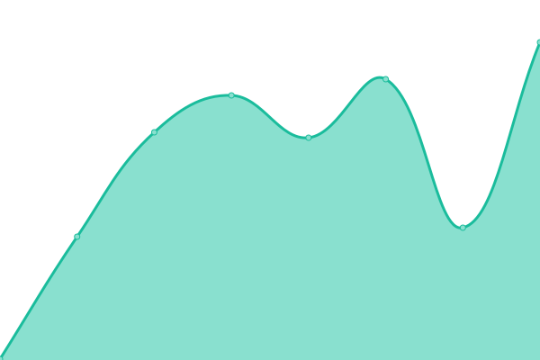
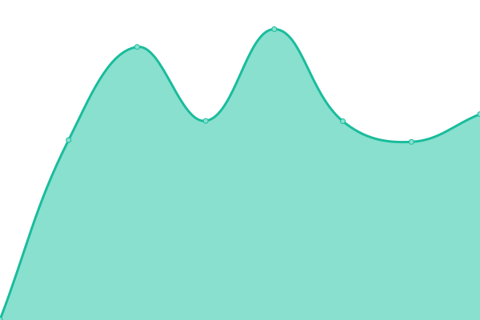

# [📈 Live Status](https://upptime.github.io/upptime): <!--live status--> **🟧 Partial outage**

This repository contains the open-source uptime monitor and status page for [Upptime](https://upptime.js.org), powered by [Upptime](https://github.com/upptime/upptime).

<!--start: status pages-->
<!-- This summary is generated by Upptime (https://github.com/upptime/upptime) -->
<!-- Do not edit this manually, your changes will be overwritten -->
<!-- prettier-ignore -->
| URL | Status | History | Response Time | Uptime |
| --- | ------ | ------- | ------------- | ------ |
|  [Recica](https://www.recica.nl) | 🟩 Up | [recica.yml](https://github.com/erecica/upptime/commits/HEAD/history/recica.yml) | 

 309ms
     
 | 

<a href="https://upptime.recica.nl/history/recica">0.00%</a>
    

|  [Luminis](https://www.luminis.eu) | 🟥 Down | [luminis.yml](https://github.com/erecica/upptime/commits/HEAD/history/luminis.yml) | 

 725ms
     
 | 

<a href="https://upptime.recica.nl/history/luminis">0.00%</a>
    

|  GOPACS | 🟩 Up | [gopacs.yml](https://github.com/erecica/upptime/commits/HEAD/history/gopacs.yml) | 

 1432ms
     
 | 

<a href="https://upptime.recica.nl/history/gopacs">0.00%</a>
    

<!--end: status pages-->

[**Visit our status website →**](https://upptime.github.io/upptime)

## 📄 License

- Powered by: [Upptime](https://github.com/upptime/upptime)
- Code: [MIT](./LICENSE) © [Upptime](https://upptime.js.org)
- Data in the `./history` directory: [Open Database License](https://opendatacommons.org/licenses/odbl/1-0/)
